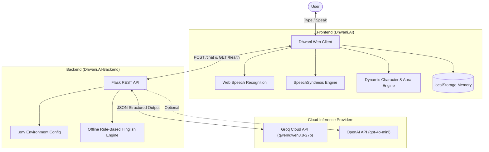

# Dhwani AI ❤️

> **"A More Human Way to Talk to AI"**  
> An expressive, voice-enabled Indian AI companion that listens, understands, feels, and speaks with personality.

---

## 1. About

**Dhwani AI** is an interactive AI companion designed from the ground up to feel warm, human-like, and conversational—not like a sterile, robotic chatbot. Rather than repeating generic assistant clichés (*"How may I assist you today?"* or *"As an AI language model..."*), Dhwani connects with you like an empathetic friend.

She converses naturally in sweet **Hinglish** (Hindi written in Roman script mixed fluidly with English), pure Hindi, or English, dynamically adapts her facial expressions and glowing aura to match 8 emotional states, visualizes her voice with a live equalizer, and remembers your name across sessions.

---

## 2. Features

- **❤️ True Companion Personality**: Warm, witty, empathetic, and slightly playful tone tailored for genuine conversations.
- **⚡ High-Speed Groq AI Integration**: Powered by Groq's high-speed inference with `qwen/qwen3.8-27b` returning structured JSON `{ "dialogue": "...", "emotion": "..." }`.
- **🎭 8-Emotion Reactive Character System**: Seamlessly shifts between `happy`, `calm`, `sad`, `surprised`, `playful`, `thinking`, `caring`, and `neutral` with dynamic glowing aura states.
- **🎙️ Hands-Free Speech-to-Text (STT)**: Native Web Speech Recognition with live state badges (*Idle*, *Listening*, *Understanding*).
- **🔊 Expressive Voice Output (TTS)**: Multi-voice synthesis prioritizing **Microsoft Kalpana** and `hi-IN` voices with calibrated pacing (0.9x speed, warm pitch) and instant speech cancellation.
- **🧠 Conversational Memory**: Automatically detects and remembers your name in browser `localStorage` and addresses you naturally.
- **🔄 Chat UX Superpowers**: 
  - Auto-expanding `textarea` with `Enter` to send and `Shift + Enter` for new lines.
  - Message actions: **Replay voice (🔊)**, **Copy text (📋)**, and **Regenerate response (🔄)**.
  - Smooth auto-scrolling and horizontal quick-prompt chips.
- **🛡️ Zero-Crash Offline Fallback Engine**: If no API key is present or when offline, an intelligent local rule-based Hinglish engine takes over seamlessly.
- **🔒 Zero-Exposure Key Security**: Built-in 1-click sanitizer (`remove_my_api_key.bat`) ensures private keys are never committed or leaked when sharing.
- **📱 Fully Responsive Glassmorphic UI**: Soft pastel rose-gold theme with frosted blur glass cards (`backdrop-filter`), accessible focus rings, and mobile-friendly touch targets.

---

## 3. Demo

### The 10-Step Interactive Companion Loop:
```
1. USER TYPES / SPEAKS  ──►  Immediate message display & auto-scroll
2. THINKING STATE       ──►  Pulsing purple aura + "Dhwani is thinking..." indicator
3. GROQ AI CALL         ──►  Multi-turn context + user name injected into prompt
4. EMOTION CLASSIFIED   ──►  Character aura shifts (e.g. Gold for happy, Rose for caring)
5. RESPONSE RENDERED    ──►  Dialogue formatted with Replay, Copy & Regenerate buttons
6. VOICE SYNTHESIS      ──►  Speech begins with live audio visualizer equalizer
7. SMOOTH RETURN        ──►  Character transitions back to serene breathing idle
```

---

## 4. Screenshots & Visual Preview

| Emotion State | Avatar Asset | Aura Glow & Badge | Mood Description |
| :--- | :--- | :--- | :--- |
| **Happy** | `smile.png` | 🌟 Golden Amber Glow (`😊 Happy & Cheerful`) | Celebrating wins, smiles, positivity |
| **Playful** | `smile.png` | 💖 Vibrant Coral Glow (`😜 Playful & Fun`) | Jokes, light teasing, laughter |
| **Surprised** | `smile.png` | ⚡ Electric Sparkle Glow (`😲 Surprised & Lively`) | Exciting news, unexpected turns |
| **Calm** | `calm.png` | 🌿 Serene Sky Blue Glow (`🌿 Peaceful & Relaxed`) | Relaxing, deep breathing, nighttime |
| **Caring** | `calm.png` | ❤️ Emerald Rose Glow (`❤️ Warm & Caring`) | Empathy, emotional support, comforting |
| **Sad** | `sad.png` | 🥺 Soft Indigo Glow (`🥺 Empathetic & Gentle`) | Shared sorrow, quiet listening |
| **Thinking** | `neutral.png`| ✨ Pulsing Violet Aura (`✨ Dhwani is thinking...`) | Processing prompt & generating |
| **Neutral** | `neutral.png`| 🌸 Soft Blossom Pink Glow (`🌸 Calm & Ready`) | Idle, attentive companion ready to talk |

---

## 5. Tech Stack

- **Frontend**:
  - Semantic HTML5 with ARIA accessibility roles (`role="log"`, `aria-live="polite"`).
  - Vanilla CSS3 Glassmorphism (`backdrop-filter: blur()`, CSS variables, dynamic keyframe animations).
  - Vanilla JavaScript (ES6+), Web Speech API (`SpeechRecognition`, `speechSynthesis`).
- **Backend API**:
  - Python 3.9+
  - Flask 3.0+ & Flask-CORS
  - OpenAI Python SDK configured for Groq base URL (`https://api.groq.com/openai/v1`)
  - `python-dotenv` for safe environment configuration
- **AI Inference**:
  - Primary: **Groq API** (`qwen/qwen3.8-27b`)
  - Secondary fallback: **OpenAI API** (`gpt-4o-mini`) / OpenRouter
  - Offline fallback: Built-in local Hinglish conversational pattern engine

---

## 6. Architecture



---

## 7. Installation

### Prerequisites
- Python 3.9 or newer installed on your computer.
- A modern web browser (Google Chrome or Microsoft Edge recommended for voice input).

### Step-by-Step Setup
1. **Clone the repository:**
   ```bash
   git clone https://github.com/your-username/dhwani-ai.git
   cd dhwani-ai
   ```

2. **Set up Python Virtual Environment (Recommended):**
   ```bash
   cd Dhwani.AI-Backend
   python -m venv venv
   # On Windows:
   venv\Scripts\activate
   # On macOS / Linux:
   source venv/bin/activate
   ```

3. **Install Dependencies:**
   ```bash
   pip install -r requirements.txt
   ```

---

## 8. Environment Variables

Create a file named `.env` inside `Dhwani.AI-Backend/` (or copy `.env.example`):

```env
# Optional server-level fallback Groq key (Users enter their own BYOK key in Settings)
GROQ_API_KEY=

# Optional CORS allowed origin (e.g. your deployed Netlify URL)
FRONTEND_URL=https://your-dhwani-app.netlify.app

# Server Configuration (Render sets PORT automatically)
PORT=5000
HOST=0.0.0.0
```

> [!IMPORTANT]
> - **Zero Server Persistence**: Dhwani AI uses client-side BYOK. User API keys are stored in the browser's localStorage and sent only with requests. The backend never writes keys to `.env` or disk.
> - Never hardcode or push your `.env` file to GitHub.
> - `.gitignore` is already configured to automatically ignore `.env`.

---

## 9. Running Locally

### Method 1: 1-Click Launcher (Windows)
Double-click **`start_dhwani.bat`** in the project root folder.
This script:
1. Cleans any stale processes on port 5000.
2. Starts the Flask backend server.
3. Automatically launches `Dhwani.AI/index.html` in your default browser.

### Method 2: Manual Start
1. **Start the backend server:**
   ```bash
   cd Dhwani.AI-Backend
   python app.py
   ```
2. **Open the frontend:**
   Open `Dhwani.AI/index.html` directly in your browser, or serve it with VS Code Live Server / Python HTTP server:
   ```bash
   cd Dhwani.AI
   python -m http.server 8000
   ```
   Navigate to `http://localhost:8000`.

### Sanitizing Before Sharing (1-Click)
Before submitting to school/college, GitHub, or portfolio reviewers, double-click **`remove_my_api_key.bat`**. This instantly wipes your secret key from `.env` while preserving the project for the recipient.

---

## 10. Voice Support

Dhwani AI uses the browser's native `window.speechSynthesis` API:
- **Priority Voice Detection**:
  1. `Microsoft Kalpana - Hindi (India)`
  2. `Google हिन्दी` / `hi-IN` female voices
  3. Natural English-Indian voices (`en-IN`)
  4. System natural female fallback
- **Pacing & Acoustics**:
  - Default rate: `0.9x` (slower, natural companion cadence).
  - Pitch: `1.0` (natural vocal frequency).
  - Rate and pitch sliders are fully adjustable in **Settings (⚙️)**.
- **Speech Interruption**: Any new message, mic activation, or mute toggle immediately cancels ongoing speech to prevent overlapping voices.

---

## 11. Emotion System

Dhwani's emotion system pairs conversational sentiment with visual feedback:

```
Groq LLM / Fallback Engine
           │
           ▼
    Parsed Emotion Tag
  ("happy" | "calm" | "sad" | "surprised" | "playful" | "caring" | "thinking" | "neutral")
           │
           ├─────────────────────────────┐
           ▼                             ▼
    Avatar Image Selected         Dynamic Aura Glow Applied
  (smile / calm / sad / neutral)   (CSS Radial Box-Shadow & Keyframes)
```

- **Graceful Fallbacks**: If an emotion asset is missing or custom, it gracefully falls back without broken images.
- **Rule-Based Hybrid**: If the cloud model returns plain text or an unexpected tag, the backend's regex emotion classifier automatically assigns the best emotion.

---

## 12. Project Structure

```
AI Project/
├── start_dhwani.bat              # 1-Click Launcher (Windows)
├── remove_my_api_key.bat         # 1-Click Secret Sanitizer
├── .gitignore                    # Git ignore file (protects .env and caches)
├── README.md                     # Comprehensive documentation
│
├── Dhwani.AI/                    # Frontend Client (Web Interface)
│   ├── index.html                # Accessible glassmorphic UI, modals, character card
│   ├── style.css                 # 8 aura themes, animations, mobile media queries
│   ├── script.js                 # 10-step companion loop, STT/TTS, memory, settings
│   ├── neutral.png               # Character portrait (Calm & Ready)
│   ├── smile.png                 # Character portrait (Happy, Playful & Surprised)
│   ├── calm.png                  # Character portrait (Serene & Caring)
│   └── sad.png                   # Character portrait (Empathetic & Gentle)
│
└── Dhwani.AI-Backend/            # Backend Server (Flask REST API)
    ├── app.py                    # Multi-provider routing (Groq), emotion classifier, fallback engine
    ├── requirements.txt          # Python dependencies (Flask, CORS, OpenAI, Dotenv)
    ├── .env.example              # Environment variables template
    └── .env                      # Active private keys (KEEP PRIVATE!)
```

---

## 13. Roadmap

- [x] High-speed Groq API integration (`qwen/qwen3.8-27b`)
- [x] 8 emotional states with dynamic aura visual feedback
- [x] Speech-to-Text with multi-state visual indicators
- [x] Conversational name memory
- [x] Auto-expanding input with `Shift + Enter` multiline support
- [x] Response regeneration and copy to clipboard
- [ ] Custom avatar portrait generation via Generative AI
- [ ] Hands-free wake word detection (*"Hey Dhwani"*)
- [ ] Multi-lingual Indian voice support (Tamil, Telugu, Bengali, Marathi)

---

## 14. Limitations

1. **Browser Speech Recognition Support**: Web Speech Recognition (`webkitSpeechRecognition`) is natively supported on Chromium-based browsers (Google Chrome, Microsoft Edge, Brave). Firefox and Safari have limited STT support.
2. **Microphone Permissions**: The browser requires user permission to access the microphone. Voice input requires an active audio capture device.
3. **Speech Autoplay Policies**: Modern browsers require at least one user click on the page before playing audio synthesis.
4. **Offline Mode Depth**: While the offline fallback engine provides rich conversational Hinglish replies, complex general knowledge queries require active Groq cloud connectivity.

---

## 15. License

Distributed under the **MIT License**. See `LICENSE` for more information.

---

<p align="center">
  Crafted with ❤️ for a more human connection with Artificial Intelligence.
</p>
